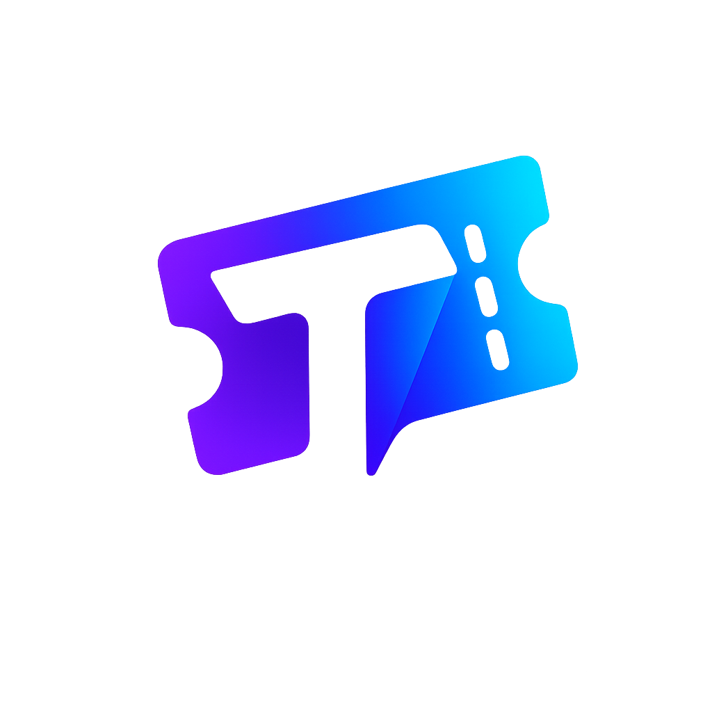

<div align="center">

  

  # 🎟️ Tiqora
  **Next-Gen Events, Sports Matches & Live Entertainment Ticketing Platform**

  An ultra-fast, modern ticketing platform built for football matches, high-stakes sports showdowns, music festivals, and live entertainment. Engineered with **Next.js 16 (App Router & React Server Components)**, **TypeScript**, **Tailwind CSS v4**, and cloud infrastructure.

  <p align="center">
    <a href="#-key-features">Key Features</a> •
    <a href="#-visual-showcase">Visual Showcase</a> •
    <a href="#-tech-stack">Tech Stack</a> •
    <a href="./docs/DB_STRUCTURE.md">Database Schema</a> •
    <a href="#-directory-structure">Directory Structure</a> •
    <a href="#-getting-started">Getting Started</a> •
    <a href="#-development-guidelines">Guidelines</a>
  </p>

  <p align="center">
    
    
    
    
    
    
  </p>
</div>

---

## 🌟 Overview

**Tiqora** reimagines the ticket purchasing experience from the ground up. Combining the nostalgic feel of physical ticket stubs with bleeding-edge web architecture, Tiqora delivers sub-second navigation, fluid micro-animations, real-time ticket availability, and end-to-end authentication for both fans and event organizers.

Built upon the latest **Next.js 16 App Router** standards, Tiqora utilizes **React Server Components (RSC)** for optimal data fetching performance, alongside an interactive 3D WebGL globe, responsive search/filtering facets, and dual-theme elegance.

---

## 📸 Visual Showcase

<div align="center">

### 📂 Categories Exploration Hub
Discover sports, football leagues, concerts, festivals, theatre, and e-sports with live event counts and trending tags.
<br/>


<br/><br/>

### 🎟️ Dynamic Event Slugs & Authentic Ticket Cards
Search and filter across categories with ticket-stub styling, perforated notches, barcodes, and live pricing.
<br/>


<br/><br/>

### ❤️ Favorites & Saved Events
Manage your personal wishlist with instant filtering, price tallies, quick booking links, and responsive skeleton loaders.
<br/>


<br/><br/>

### 🔍 Immersive 404 Recovery Experience
Polished error handling with interactive graphics and instant redirects back to the action.
<br/>


</div>

---

## ✨ Key Features

- 🏟️ **Sports & Matches Showcase**: Dedicated spotlight for premier football matches (Premier League, Champions League, La Liga, El Clásico) and global sporting events with real-time match countdowns and venue data.
- 🎟️ **Authentic Ticket Stub Aesthetic**: Custom card components replicating vintage and modern ticket stubs, complete with perforated punch notches, barcodes, tear lines, and dynamic status badges (*Selling Fast*, *Almost Gone*, *Available*).
- 🌐 **Interactive 3D WebGL Globe**: High-performance interactive globe visualization powered by `cobe`, showcasing global event hotspots directly on the homepage.
- 📂 **Dynamic Category Explorer (`/categories` & `/events/[category]`)**:
  - Full-featured browsing hub with popular categories, event density metrics, and direct deep-links.
  - Dynamic category routes with breadcrumb navigation, live search, price sliders, and date filters.
- ❤️ **Personalized Wishlist & Favorites (`/favorites`)**:
  - Save matches and events with 1-click toggling.
  - Dedicated favorites manager with category tabs, total cost calculators, and seamless empty state handling.
- 🔐 **Comprehensive Auth & Identity (`/(auth)` & `/admin`)**:
  - **Supabase SSR** powered authentication with encrypted session cookies.
  - **Google OAuth** and standard credential login.
  - Role-aware onboarding (Fans vs. Event Organizers).
  - Password recovery and reset pipelines (`/forgot-password`, `/reset-password`).
  - Dedicated **Organizer & Admin Portal** login (`/admin/login`).
- 🎧 **Enterprise Contact & Support Desk (`/contact` & `/admin/contacts`)**:
  - Inquiry submission with automated ticket numbers (`TIQ-######`), departmental routing (*General*, *Booking*, *Technical*, *Billing*, *Partnerships*), anti-spam honeypot, IP rate limiting, and private attachment uploads up to 2MB (with a 20MB 30-day quota).
  - Admin support console with status lifecycle management (*Open*, *In Progress*, *Resolved*, *Closed*), department filtering, internal staff notes, and 1-hour expiring signed download links for attachments.
- 📬 **Newsletter & Audience Growth Engine (`/admin/newsletter`)**:
  - Instant subscription engine integrated in the footer with RFC-5322 validation, duplicate rejection, and opt-out support.
  - Admin subscriber management dashboard with real-time KPI cards (active subscribers, unsubscriptions, retention rate), instant CSV export, and subscriber search/status toggling.
- 🗂️ **Taxonomy & Category Administration (`/admin/categories` & `/admin/subcategories`)**:
  - Administrative control over event categories and subcategories with automated slug generation, Lucide icon binding, cover image uploads, and active display order sorting.
- ⚖️ **Legal, Compliance & Policy Suite (`/terms`, `/privacy`, `/ticket-policy`)**:
  - Structured, responsive legal pages covering user Terms of Service, GDPR/CCPA Privacy Policy (data collection, retention, user rights), and Tiqora Ticket Policy (refunds, cancellations, transfers, and entry protocols).
- ❓ **Interactive FAQ Knowledge Base (`/faqs`)**:
  - Categorized help center covering ticket purchases, booking policies, digital stubs, and account management.
- 👤 **User Profile & Notifications Hub (`/profile` & `/notifications`)**:
  - Dedicated user profile customization, avatar uploads, and notification inbox for booking alerts.
- 🌓 **Adaptive Dual Theme (Light & Dark)**:
  - Custom Tailwind CSS v4 design system with smooth color shifts.
  - Automatic system preference detection with manual override toggle.
- 🛡️ **Next.js 16 Proxy Architecture**:
  - Built on Next.js 16's official `src/proxy.ts` convention, maintaining safe, continuous token refreshes and route protection without deprecated middleware patterns.
- 💳 **Payment & Notification Ready**:
  - Integrated with **Stripe** SDK for checkout sessions and webhook processing.
  - Transactional email dispatch powered by **Resend**.

---

## ⚡ Tech Stack

| Layer | Technology | Description |
| :--- | :--- | :--- |
| **Framework** | [Next.js 16 (App Router)](https://nextjs.org/) | React Server Components, server actions, dynamic routing |
| **Core UI** | [React 19](https://react.dev/) | Concurrent mode, optimistic UI transitions |
| **Language** | [TypeScript 5](https://www.typescriptlang.org/) | End-to-end type safety across clients, server actions, and schemas |
| **Styling** | [Tailwind CSS v4](https://tailwindcss.com/) | PostCSS v4 engine, CSS variable design tokens |
| **Animations** | [Framer Motion](https://www.framer.com/motion/) | Cohesive micro-interactions, modal transitions, and route animations |
| **3D Graphics** | [Cobe](https://github.com/shuding/cobe) | Lightweight 5kB WebGL 3D globe animation |
| **Database & Auth** | [Supabase](https://supabase.com/) | PostgreSQL backend, `@supabase/ssr` session management |
| **Validation** | [Zod](https://zod.dev/) | Client and server-side runtime schema validation |
| **Payments** | [Stripe](https://stripe.com/) | Node SDK & Stripe.js checkout infrastructure |
| **Emails** | [Resend](https://resend.com/) | High-deliverability transactional email service |
| **Toasts** | [Sonner](https://sonner.emilkowal.ski/) | Non-intrusive, customizable UI toast notifications |
| **Icons** | [Lucide React](https://lucide.dev/) | Clean, consistent SVG icon set |

---

## 📁 Directory Structure

```text
tiqora/
├── public/                           # Brand assets, screenshots & static media
│   ├── new-logo.png                  # Updated modern high-resolution brand logo
│   ├── Tiqora logo.png               # Official Tiqora brand logo
│   ├── logo.png                      # Brand logo alias
│   ├── Categories-page.png           # Categories hub preview
│   ├── Favorite.png                  # Favorites page preview
│   ├── slug-pages.png                # Dynamic category events preview
│   ├── 404-page.png                  # Not found preview
│   ├── hero/                         # Hero section visuals
│   └── sigupAndLogin/                # Auth banners and split-card media
├── src/
│   ├── app/                          # Next.js App Router
│   │   ├── (auth)/                   # Authentication route group (login, signup, reset)
│   │   ├── actions/                  # Server Actions
│   │   │   ├── admin-categories.ts   # Category CRUD & upload actions
│   │   │   ├── admin-organizers.ts   # Organizer onboarding actions
│   │   │   ├── admin-subcategories.ts # Subcategory CRUD actions
│   │   │   ├── auth.ts               # Auth server actions (login, signup, OAuth)
│   │   │   ├── contact.ts            # Support ticket submission & management actions
│   │   │   ├── newsletter.ts         # Newsletter subscription & export actions
│   │   │   └── profile.ts            # User profile management actions
│   │   ├── admin/                    # Admin & Organizer management portal
│   │   │   ├── (dashboard)/          # Authenticated admin layout & panels
│   │   │   │   ├── categories/       # Category management panel
│   │   │   │   ├── contacts/         # Support inquiries desk
│   │   │   │   ├── newsletter/       # Newsletter subscriber dashboard
│   │   │   │   ├── subcategories/    # Subcategory management panel
│   │   │   │   └── page.tsx          # Admin executive dashboard
│   │   │   └── login/                # Admin portal authentication
│   │   ├── auth/callback/            # OAuth callback exchange handler
│   │   ├── categories/               # Categories exploration hub
│   │   ├── contact/                  # Enterprise customer support desk & ticket submission
│   │   ├── events/                   # Global event directory & [category] slug pages
│   │   ├── faqs/                     # Customer Help & FAQ knowledge base
│   │   ├── favorites/                # User favorites & wishlist
│   │   ├── notifications/            # User alerts & notifications center
│   │   ├── privacy/                  # GDPR/CCPA Privacy Policy
│   │   ├── profile/                  # User account profile manager
│   │   ├── terms/                    # Platform Terms of Service
│   │   ├── ticket-policy/            # Event Admission & Ticket Policy
│   │   ├── globals.css               # Tailwind CSS v4 design tokens & base rules
│   │   ├── layout.tsx                # Root layout (Navbar, Footer, Toaster)
│   │   ├── not-found.tsx             # Custom interactive 404 experience
│   │   └── page.tsx                  # Tiqora homepage (Hero, Globe, Matches)
│   ├── components/
│   │   ├── admin/                    # Admin sidebar, categories, contacts, newsletter
│   │   ├── auth/                     # Split-screen auth cards, forms, Google OAuth
│   │   ├── categories/               # Categories hero, explorer, category cards
│   │   ├── contact/                  # Support contact form, ticket status, dept badges
│   │   ├── events/                   # Ticket stub cards, filter sidebar, grids
│   │   ├── faqs/                     # Interactive FAQ accordion & search filters
│   │   ├── favorites/                # Favorites explorer, item cards, sidebar
│   │   ├── home/                     # Hero, Globe, Matches, CTA, App promo
│   │   ├── layout/                   # Global Navbar & comprehensive Footer (w/ newsletter)
│   │   ├── legal/                    # Policy legal article layouts & sticky navigation
│   │   ├── notifications/            # Notification list & status indicators
│   │   ├── profile/                  # Profile forms & avatar management
│   │   ├── theme-toggle.tsx          # Dark/Light mode theme switcher
│   │   └── ui/                       # Primitive design tokens (Button, Badge, Toaster)
│   ├── lib/
│   │   ├── supabase/                 # Supabase client (client.ts, server.ts, middleware.ts)
│   │   ├── validations/              # Zod validation schemas (auth, contact, newsletter, etc.)
│   │   ├── categories-data.ts        # Categories catalog & metadata
│   │   ├── events-data.ts            # Sports matches & events mock database
│   │   ├── home-data.ts              # Homepage curated showcase data
│   │   ├── stripe.ts                 # Stripe Node SDK instance
│   │   ├── resend.ts                 # Resend email client instance
│   │   └── utils.ts                  # Class merger utility (`cn`)
│   ├── types/                        # TypeScript type declarations
│   │   ├── auth.ts                   # Auth & user profile definitions
│   │   ├── categories.ts             # Category data structures
│   │   ├── contact.ts                # Support ticket & attachment types
│   │   ├── events.ts                 # Event, match & ticket stub types
│   │   ├── faqs.ts                   # Help center & FAQ models
│   │   ├── newsletter.ts             # Newsletter subscription types
│   │   ├── notifications.ts          # Alert & notification models
│   │   └── subcategories.ts          # Subcategory taxonomy definitions
│   └── proxy.ts                      # Next.js 16 Proxy handler (session refresh)
├── docs/
│   ├── DB_STRUCTURE.md               # Database ER diagrams, relationships & schema dictionary
│   ├── db-diagram.svg                # Full visual relational architecture SVG diagram
│   └── PR_REVIEW_CHECKLIST.md        # Code review & PR submission standards
├── AGENTS.md                         # Engineering rules and conventions
├── .env.example                      # Environment variables reference
├── package.json
└── tsconfig.json
```

---

## 🚀 Getting Started

### Prerequisites
- **Node.js**: `v22.0.0` or higher
- **npm** (or `pnpm` / `yarn`)

### 1. Clone & Install
```bash
git clone https://github.com/AbdullahAhmed903/Tiqora.git
cd Tiqora
npm install
```

### 2. Configure Environment Variables
Copy the `.env.example` file to create your local `.env.local`:
```bash
cp .env.example .env.local
```

Populate the required credentials in `.env.local`:
```env
# Application URL
NEXT_PUBLIC_APP_URL=http://localhost:3000

# Supabase (Console > Project Settings > API)
NEXT_PUBLIC_SUPABASE_URL=https://your-project-id.supabase.co
NEXT_PUBLIC_SUPABASE_PUBLISHABLE_KEY=your-supabase-publishable-key
SUPABASE_SECRET_KEY=your-supabase-secret-key

# Stripe Payment Gateway
NEXT_PUBLIC_STRIPE_PUBLISHABLE_KEY=pk_test_...
STRIPE_SECRET_KEY=sk_test_...
STRIPE_WEBHOOK_SECRET=whsec_...

# Resend Transactional Email
RESEND_API_KEY=re_...
RESEND_FROM_EMAIL=onboarding@resend.dev
```

### 3. Run Development Server
```bash
npm run dev
```
Open [http://localhost:3000](http://localhost:3000) in your browser to explore Tiqora.

### 4. Build for Production
```bash
# Verify TypeScript and create optimized production build
npm run build

# Start the production server
npm run start
```

### 5. Run Linting
```bash
npm run lint
```

---

## 🛡️ Engineering & Contribution Guidelines

To maintain code quality and architectural integrity, all contributors adhere to the standards outlined in [AGENTS.md](./AGENTS.md) and [docs/PR_REVIEW_CHECKLIST.md](./docs/PR_REVIEW_CHECKLIST.md):

1. **Branching Strategy**: All pull requests must target the `dev` branch. Direct merges or PRs to `main` are strictly forbidden.
2. **Next.js 16 Proxy Convention**: Tiqora strictly uses `src/proxy.ts` for session handling. Never reintroduce deprecated `middleware.ts` files.
3. **Database Policy**: Database schemas, RLS policies, and migrations are managed directly in the Supabase Console. Do not create local `.sql` migration files.
4. **UI Primitives**: Components in `src/components/ui/` (`button.tsx`, `badge.tsx`, `toaster.tsx`) are foundational design tokens and are read-only.
5. **Animation Engine**: [Framer Motion](https://www.framer.com/motion/) is the sole approved animation library. Do not add auxiliary animation libraries.
6. **Zero Force-Push Policy**: `git push --force` or `git push -f` is strictly forbidden across all branches.

---

## 📄 License

This project is proprietary and maintained by the **Tiqora Core Team**. All rights reserved.

<div align="center">
  <sub>Built with ❤️ for sports fans and live event enthusiasts worldwide.</sub>
</div>
