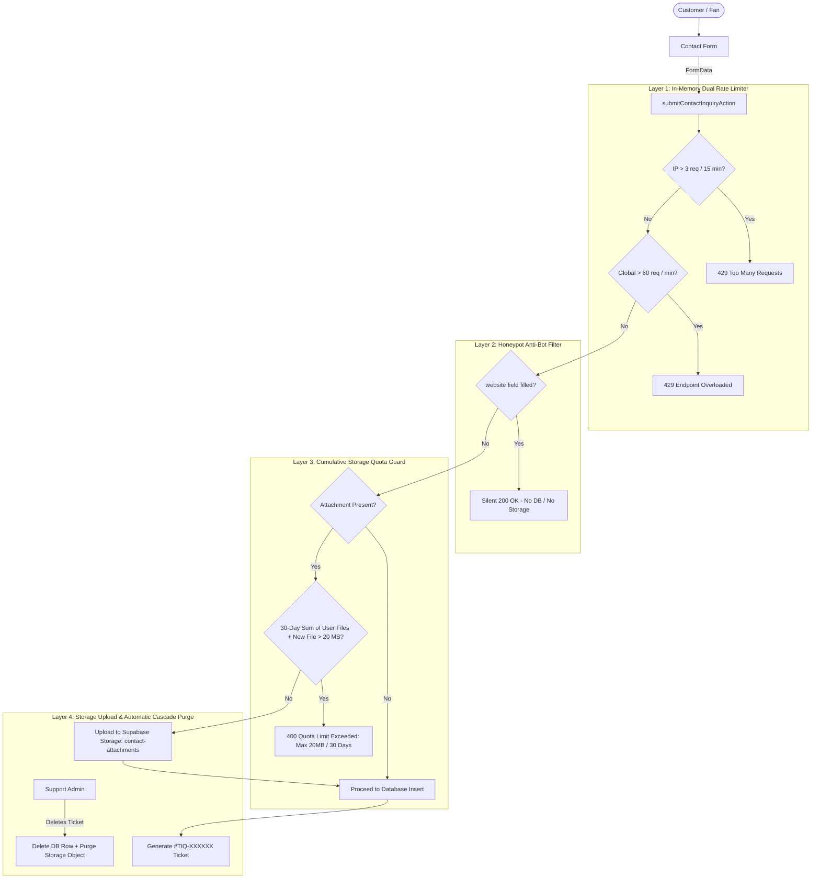

# Contact Us Backend, Storage Quota System & Admin Management — Architecture Plan

This document defines the complete technical specification, database schema, storage anti-abuse protections, server actions, and admin management console for the **Contact & Support Inquiries System** on **Tiqora**.

---

## 1. Executive Summary

The **Contact Us System** allows fans, event organizers, and customers to submit support inquiries with optional picture or document attachments (e.g. ticket screenshots, receipts, stadium gate disputes, PDF documents).

Because this endpoint is **publicly accessible**, it introduces distinct security and resource challenges:
1. **Volumetric Request Spam**: Malicious automated bots flooding the endpoint.
2. **Storage Quota Depletion ("0.5 GB Problem")**: A malicious or abusive user repeatedly uploading 2MB+ attachments every day, consuming gigabytes of cloud storage.
3. **MIME/File Spoofing**: Executables or malicious scripts disguised as images or documents.
4. **Support Ticket Tracking**: Admins must be able to filter, review, track statuses (`new`, `pending`, `resolved`), and reply via Email or WhatsApp directly from the dashboard.

---

## 2. Anti-Abuse & Storage Defense Strategy

To eliminate storage depletion while ensuring genuine users can upload necessary proofs, we implement a **4-Layer Defense Architecture**:



### 2.1. Multi-Tier Breakdown

| Defense Layer | Mechanism | Limit | Failure Response |
| :--- | :--- | :--- | :--- |
| **Layer 1: Dual Rate Limiter** | In-Memory Sliding Window (`rate-limit.ts`) | **3 submissions / 15 mins (Per IP)**<br>**60 submissions / minute (Global)** | `429 Too Many Requests` |
| **Layer 2: Honeypot Trap** | Invisible dummy field (`website`) | Must remain empty | Silently returns success without database or storage interaction |
| **Layer 3: 30-Day User Storage Quota** | Database query: `SUM(attachment_size_bytes)` per email in last 30 days | **Max 20 MB cumulative storage per email** | `400 Bad Request`: "Attachment quota exceeded (20MB limit reached for this month)." |
| **Layer 4: Daily Submission Cap** | Database check: `COUNT(*)` in last 24h | **Max 5 submissions per email / 24 hours** | Prevents daily repetitive spamming |
| **Layer 5: Cascade Storage Purge** | Server Action deletion hook | Real-time cleanup | Deleting a ticket immediately deletes the file from `contact-attachments` |

---

## 3. Database Migration Script (Ready for Supabase SQL Editor)

```sql
-- ==============================================================================
-- Tiqora Database Migration: Contact Submissions Table, Storage & RLS
-- Migration: create_contact_submissions_table_and_storage.sql
-- ==============================================================================

-- ------------------------------------------------------------------------------
-- 1. TABLE: public.contact_submissions
-- ------------------------------------------------------------------------------

CREATE TABLE IF NOT EXISTS public.contact_submissions (
    id UUID PRIMARY KEY DEFAULT gen_random_uuid(),
    ticket_number TEXT NOT NULL UNIQUE,
    full_name TEXT NOT NULL,
    email TEXT NOT NULL,
    phone TEXT NOT NULL,
    department TEXT NOT NULL CHECK (department IN ('tickets', 'payments', 'stadium', 'organizers', 'technical', 'general')),
    status TEXT NOT NULL DEFAULT 'new' CHECK (status IN ('new', 'pending', 'resolved')),
    subject TEXT,
    message TEXT NOT NULL,
    attachment_url TEXT,
    attachment_path TEXT,
    attachment_name TEXT,
    attachment_size_bytes BIGINT,
    attachment_mime_type TEXT,
    ip_address TEXT,
    admin_notes TEXT,
    resolved_at TIMESTAMPTZ,
    created_at TIMESTAMPTZ DEFAULT timezone('utc'::text, now()) NOT NULL,
    updated_at TIMESTAMPTZ DEFAULT timezone('utc'::text, now()) NOT NULL,

    -- Data integrity constraints
    CONSTRAINT contact_name_not_empty CHECK (char_length(trim(full_name)) >= 2),
    CONSTRAINT contact_email_not_empty CHECK (char_length(trim(email)) >= 5),
    CONSTRAINT contact_phone_not_empty CHECK (char_length(trim(phone)) >= 6),
    CONSTRAINT contact_message_not_empty CHECK (char_length(trim(message)) >= 10)
);

-- ------------------------------------------------------------------------------
-- 2. INDEXES
-- ------------------------------------------------------------------------------

-- Unique lookup by ticket number (e.g. #TIQ-783921)
CREATE UNIQUE INDEX IF NOT EXISTS idx_contact_ticket_number 
ON public.contact_submissions (ticket_number);

-- Fast lookup for quota check and user history by email
CREATE INDEX IF NOT EXISTS idx_contact_email_lower 
ON public.contact_submissions (LOWER(TRIM(email)));

-- Filter by ticket workflow status (new, pending, resolved)
CREATE INDEX IF NOT EXISTS idx_contact_status 
ON public.contact_submissions (status);

-- Filter by department
CREATE INDEX IF NOT EXISTS idx_contact_department 
ON public.contact_submissions (department);

-- Chronological sorting for admin inbox
CREATE INDEX IF NOT EXISTS idx_contact_created_at 
ON public.contact_submissions (created_at DESC);

-- Composite index for cumulative 30-day storage quota calculation
CREATE INDEX IF NOT EXISTS idx_contact_storage_quota 
ON public.contact_submissions (LOWER(TRIM(email)), created_at DESC) 
WHERE attachment_size_bytes IS NOT NULL;

-- ------------------------------------------------------------------------------
-- 3. AUTOMATIC UPDATED_AT TRIGGER
-- ------------------------------------------------------------------------------

CREATE OR REPLACE FUNCTION public.set_contact_submissions_updated_at()
RETURNS TRIGGER
LANGUAGE plpgsql
AS $$
BEGIN
    NEW.updated_at = timezone('utc'::text, now());
    RETURN NEW;
END;
$$;

DROP TRIGGER IF EXISTS trigger_contact_submissions_updated_at ON public.contact_submissions;
CREATE TRIGGER trigger_contact_submissions_updated_at
    BEFORE UPDATE ON public.contact_submissions
    FOR EACH ROW
    EXECUTE FUNCTION public.set_contact_submissions_updated_at();

-- ------------------------------------------------------------------------------
-- 4. ROW LEVEL SECURITY (RLS) POLICIES
-- ------------------------------------------------------------------------------

ALTER TABLE public.contact_submissions ENABLE ROW LEVEL SECURITY;

-- 4.1 Anyone can submit (both anonymous visitors and authenticated users)
DROP POLICY IF EXISTS "Anyone can submit contact inquiry" ON public.contact_submissions;
CREATE POLICY "Anyone can submit contact inquiry"
    ON public.contact_submissions FOR INSERT
    WITH CHECK (true);

-- 4.2 Only Admins can view contact submissions
DROP POLICY IF EXISTS "Only admins can view contact submissions" ON public.contact_submissions;
CREATE POLICY "Only admins can view contact submissions"
    ON public.contact_submissions FOR SELECT
    TO authenticated
    USING (public.is_admin(auth.uid()));

-- 4.3 Only Admins can update status and admin notes
DROP POLICY IF EXISTS "Only admins can update contact submissions" ON public.contact_submissions;
CREATE POLICY "Only admins can update contact submissions"
    ON public.contact_submissions FOR UPDATE
    TO authenticated
    USING (public.is_admin(auth.uid()))
    WITH CHECK (public.is_admin(auth.uid()));

-- 4.4 Only Admins can delete contact submissions
DROP POLICY IF EXISTS "Only admins can delete contact submissions" ON public.contact_submissions;
CREATE POLICY "Only admins can delete contact submissions"
    ON public.contact_submissions FOR DELETE
    TO authenticated
    USING (public.is_admin(auth.uid()));

-- ------------------------------------------------------------------------------
-- 5. SUPABASE STORAGE BUCKET: contact-attachments
-- ------------------------------------------------------------------------------

INSERT INTO storage.buckets (id, name, public, file_size_limit, allowed_mime_types)
VALUES (
    'contact-attachments',
    'contact-attachments',
    true,
    10485760, -- 10MB max per file (10 * 1024 * 1024 bytes)
    ARRAY['image/jpeg', 'image/png', 'image/webp', 'image/gif', 'application/pdf']
)
ON CONFLICT (id) DO UPDATE SET
    public = true,
    file_size_limit = 10485760,
    allowed_mime_types = ARRAY['image/jpeg', 'image/png', 'image/webp', 'image/gif', 'application/pdf'];

-- 5.1 Storage Policies
DROP POLICY IF EXISTS "Public can view contact attachments" ON storage.objects;
CREATE POLICY "Public can view contact attachments"
    ON storage.objects FOR SELECT
    USING (bucket_id = 'contact-attachments');

DROP POLICY IF EXISTS "Anyone can upload contact attachments" ON storage.objects;
CREATE POLICY "Anyone can upload contact attachments"
    ON storage.objects FOR INSERT
    WITH CHECK (bucket_id = 'contact-attachments');

DROP POLICY IF EXISTS "Only admins can delete contact attachments" ON storage.objects;
CREATE POLICY "Only admins can delete contact attachments"
    ON storage.objects FOR DELETE
    TO authenticated
    USING (
        bucket_id = 'contact-attachments' AND
        public.is_admin(auth.uid())
    );
```

---

## 4. Server Actions Architecture (`src/app/actions/contact.ts`)

```typescript
// 1. Submit Action (Public)
export async function submitContactInquiryAction(
  formData: FormData
): Promise<{ success: boolean; message: string; ticketNumber?: string; code?: string }>

// 2. Admin Retrieval Action (Protected - 15 items per page)
export async function getAdminContactSubmissionsAction(params: {
  page?: number;        // default 1
  limit?: number;       // default 15
  status?: string;      // 'all' | 'new' | 'pending' | 'resolved'
  department?: string;  // 'all' | 'tickets' | 'payments' | ...
  search?: string;      // searches ticket_number, full_name, email
}): Promise<{
  data?: {
    submissions: ContactSubmission[];
    totalCount: number;
    page: number;
    limit: number;
    totalPages: number;
    counts: { all: number; new: number; pending: number; resolved: number };
  };
  error?: string;
}>

// 3. Status Update Action (Protected)
export async function updateContactStatusAction(params: {
  id: string;
  status: "new" | "pending" | "resolved";
  adminNotes?: string;
}): Promise<{ success: boolean; error?: string }>

// 4. Delete Ticket & Storage File Action (Protected)
export async function deleteContactSubmissionAction(
  id: string
): Promise<{ success: boolean; error?: string }>
```

---

## 5. Admin Dashboard Specification (`/admin/contacts`)

### 5.1. Overview Table (15 rows per page)
* **Metrics Cards Header**:
  * 📬 **New Inquiries**: Count of status `'new'` (Blue badge)
  * ⏳ **Pending Review**: Count of status `'pending'` (Amber badge)
  * ✅ **Resolved**: Count of status `'resolved'` (Green badge)
  * 📊 **Total Submissions**: Grand total
* **Filters**:
  * Status switcher pills: `All`, `New`, `Pending`, `Resolved`
  * Department filter dropdown
  * Search bar with real-time or debounce search
* **Table Columns**:
  1. `Ticket #` (Badge, e.g. `#TIQ-849201`)
  2. `Sender` (Full name & email)
  3. `Phone` (Formatted E.164 with country flag)
  4. `Department` (Icon pill)
  5. `Status` (Color-coded badge)
  6. `Attachment` (Paperclip icon + size indicator, or `-`)
  7. `Date` (Relative date, e.g. `10m ago`, `2d ago`)
  8. `Actions` ("View Details", "WhatsApp", "Email")
* **Pagination**: `<Pagination page={page} totalPages={totalPages} />` (15 items/page).

### 5.2. Slide-Over Details Drawer (Popup Window)
Clicking any ticket row opens a side sheet containing:
1. **Status Selector**: Quick dropdown to transition between `New` → `Pending` → `Resolved`.
2. **Contact Direct Actions**:
   * 💬 **WhatsApp**: Formatted link:
     ```
     https://wa.me/{cleanPhone}?text=Hello%20{fullName},%20this%20is%20Tiqora%20Support%20regarding%20ticket%20{ticketNumber}...
     ```
   * ✉️ **Email**: Pre-filled link:
     ```
     mailto:{email}?subject=Re:%20[{ticketNumber}]%20{subject}
     ```
   * 📞 **Phone Call**: `tel:{cleanPhone}`.
3. **Message Body**: Subject, department tag, and complete message text.
4. **Attachment Viewer**:
   * If image: Thumbnail preview with zoom/lightbox and download button.
   * If PDF: Document card displaying file name, size, and "Open PDF in New Window".
5. **Internal Admin Notes**: Editable textarea to track internal resolution steps.
6. **Delete Ticket**: Confirmation modal that purges both the database record and the storage file.

---

## 6. Implementation Checklist

- [ ] **Phase 1: Database & Storage**
  - Run SQL script in Supabase Console
  - Verify bucket `contact-attachments` is created with 10MB limit and MIME restrictions
- [ ] **Phase 2: Types & Validations**
  - Expand [`src/types/contact.ts`](file:///e:/Abdullah/tensorik/Events/src/types/contact.ts) with database entity models
  - Verify [`src/lib/validations/contact.ts`](file:///e:/Abdullah/tensorik/Events/src/lib/validations/contact.ts)
- [ ] **Phase 3: Server Actions**
  - Create `src/app/actions/contact.ts`
  - Implement dual rate limiter (`rateLimiter.check`)
  - Implement 30-day cumulative quota calculation
  - Implement storage upload and DB insert
  - Implement admin retrieval (15/page), status update, and cascade delete
- [ ] **Phase 4: Client Form Integration**
  - Connect [`src/components/contact/contact-form.tsx`](file:///e:/Abdullah/tensorik/Events/src/components/contact/contact-form.tsx) to call `submitContactInquiryAction`
  - Display actual generated ticket number upon success
- [ ] **Phase 5: Admin Panel UI**
  - Create `src/components/admin/contact/contact-table.tsx`
  - Create `src/components/admin/contact/contact-details-drawer.tsx`
  - Create `src/app/admin/(dashboard)/contacts/page.tsx`
  - Add navigation entry in [`src/components/admin/admin-sidebar.tsx`](file:///e:/Abdullah/tensorik/Events/src/components/admin/admin-sidebar.tsx)
- [ ] **Phase 6: Quality & Regression Verification**
  - Run `npx tsc --noEmit`
  - Run `npx eslint`
  - Run `npm run build`
