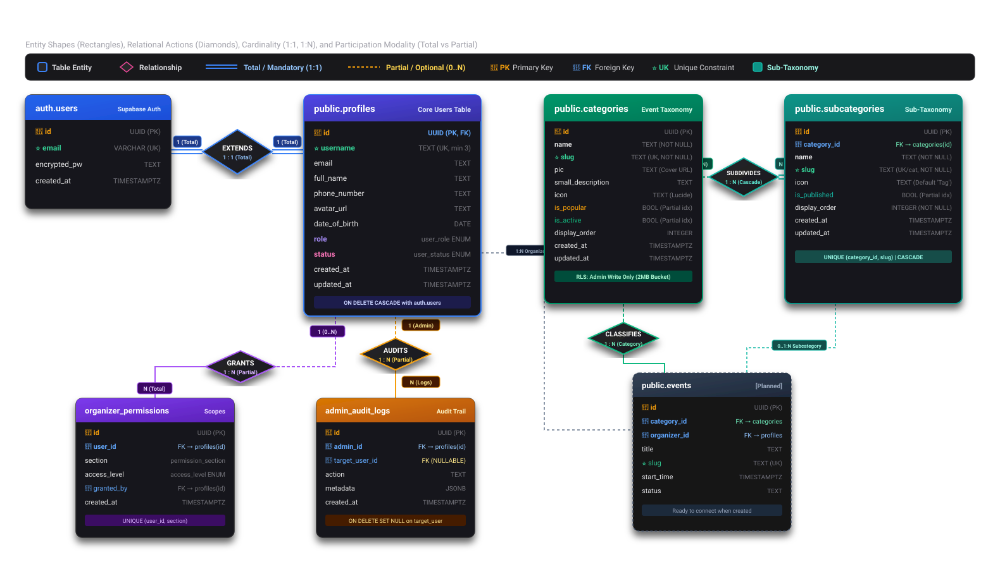
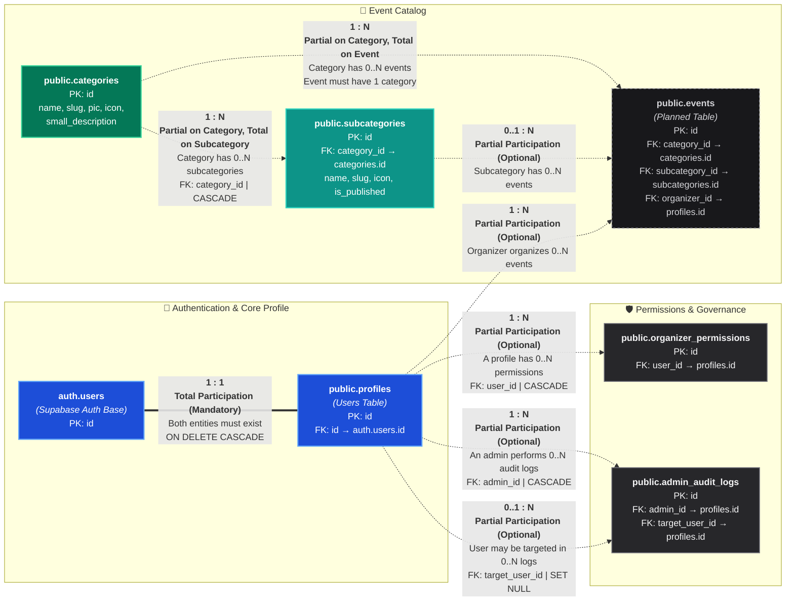
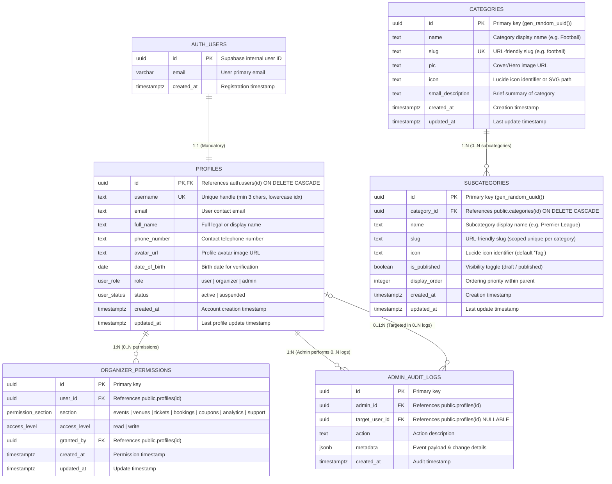
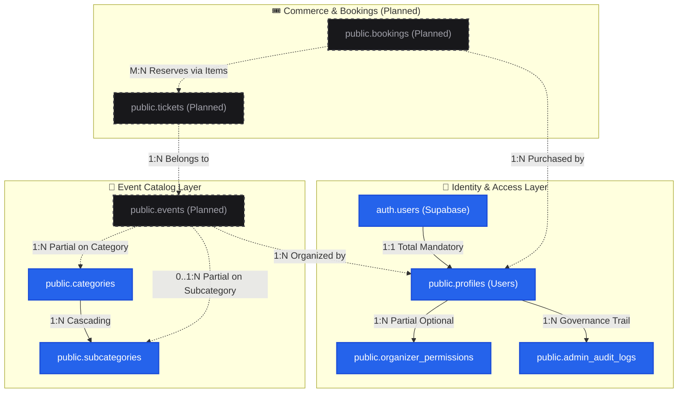
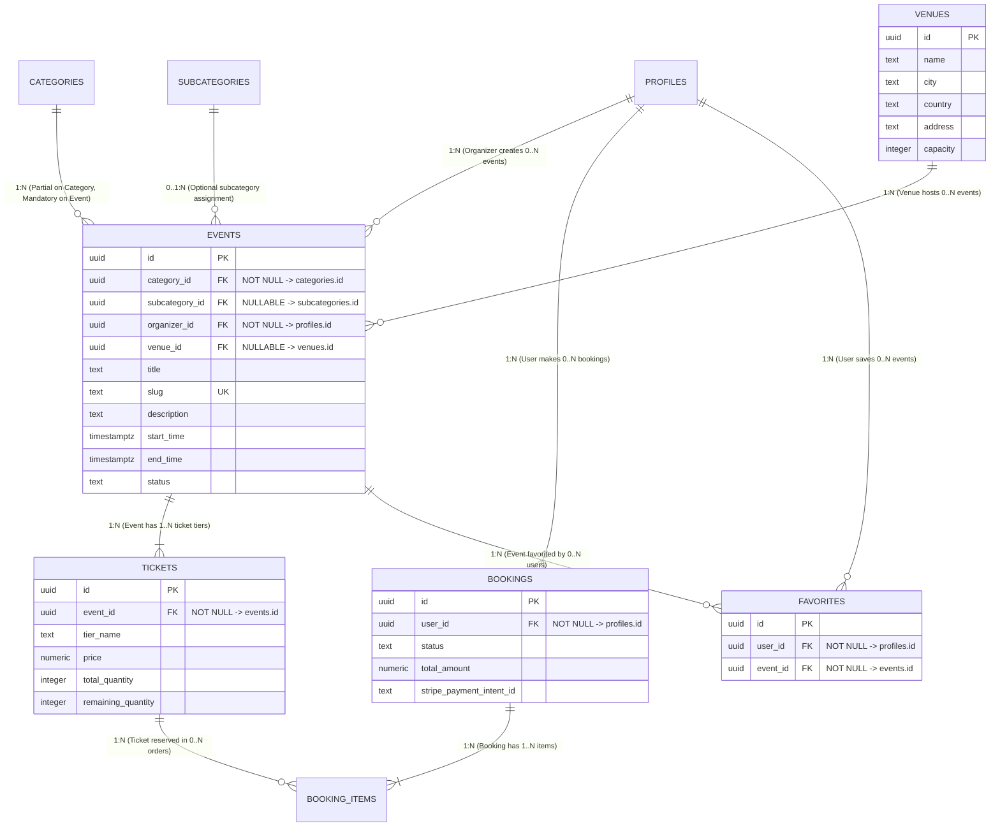

# 🗄️ Tiqora Database Structure & Relational Diagrams

This document serves as the official, living schema reference and relational diagram repository for the **Tiqora** database (PostgreSQL on Supabase).

> [!NOTE]
> **Schema Management Policy**: Database schemas and tables are managed directly in the Supabase Console. This document tracks current tables, relational integrity, data types, constraints, and planned schema expansions.

---

## 📑 Table of Contents

1. [Visual Relationships & Cardinality Diagram](#-visual-relationships--cardinality-diagram)
2. [Relational Rules: Cardinality & Participation Explained](#-relational-rules-cardinality--participation-explained)
3. [Relational Integrity Matrix](#-relational-integrity-matrix)
4. [Entity-Relationship Diagram (ERD)](#-entity-relationship-diagram-erd)
5. [High-Level Domain Architecture](#-high-level-domain-architecture)
6. [Tables Data Dictionary](#-tables-data-dictionary)
   - [auth.users (Supabase Managed)](#1-authusers-supabase-auth)
   - [public.profiles (User Accounts)](#2-publicprofiles-user-accounts)
   - [public.categories (Event Categories)](#3-publiccategories-event-categories)
   - [public.subcategories (Sub-categories)](#4-publicsubcategories-sub-categories)
   - [storage.buckets (category-images)](#5-storagebuckets-category-images)
   - [public.organizer_permissions](#6-publicorganizer_permissions)
   - [public.admin_audit_logs](#7-publicadmin_audit_logs)
7. [Custom Enums & Types](#-custom-enums--types)
8. [Planned Schema Roadmap](#-planned-schema-roadmap-upcoming-tables)
9. [Update Procedure](#-how-to-update-this-document)

---

## 🔗 Visual Relationships & Cardinality Diagram

The diagram below specifically illustrates **Cardinality** (`1:1`, `1:N`, `M:N`) and **Participation Constraints** (**Total / Mandatory** vs. **Partial / Optional**) using graphical entity shapes (rectangles), relational actions (diamonds), and double/dashed connector lines:

<div align="center">
  
</div>

<br/>

> [!TIP]
> You can also open the raw vector graphic directly: [db-diagram.svg](./db-diagram.svg).

<details>
<summary><b>Click to view Markdown Mermaid Code</b></summary>


</details>

---

## 📐 Relational Rules: Cardinality & Participation Explained

In relational database modeling, relationships have two primary dimensions: **Cardinality Ratio** and **Participation Modality**.

### 1. `1 : 1` Total Participation (Mandatory &harr; Mandatory)
* **Entities**: `auth.users` &harr; `public.profiles`
* **Rule**:
  - Every authenticated user in `auth.users` **must** have exactly one corresponding row in `public.profiles`.
  - A profile cannot exist without a valid `auth.users` record (`profiles.id` is both a Primary Key and Foreign Key referencing `auth.users(id)`).
  - Deleting the auth account triggers an `ON DELETE CASCADE`, deleting the profile automatically.

### 2. `1 : N` Partial Participation (Optional &rarr; Mandatory)
* **Entities**: `public.profiles` &rarr; `public.organizer_permissions`
* **Rule**:
  - **Parent (`profiles`) is Partial / Optional**: A normal fan (`role = 'user'`) has `0` rows in `organizer_permissions`. Only organizers have rows.
  - **Child (`organizer_permissions`) is Total / Mandatory**: An organizer permission record **must** belong to an existing user (`user_id NOT NULL`).

### 3. `1 : N` Partial Participation with `SET NULL`
* **Entities**: `public.profiles` &rarr; `public.admin_audit_logs` (`target_user_id`)
* **Rule**:
  - A profile may be targeted `0` times (regular compliant user) or many times.
  - An audit log does not always target an account (e.g. system configuration change where `target_user_id IS NULL`).
  - If a targeted user profile is ever deleted, the audit log remains for compliance with `target_user_id` set to `NULL` (`ON DELETE SET NULL`).

### 4. `1 : N` Category to Subcategories (Active Structure)
* **Entities**: `public.categories` &rarr; `public.subcategories`
* **Rule**:
  - **Parent (`categories`) is Partial / Optional**: A parent category can exist without any subcategories (`0..N`).
  - **Child (`subcategories`) is Total / Mandatory**: Every subcategory **must** belong to an existing parent category (`category_id UUID NOT NULL REFERENCES categories(id) ON DELETE CASCADE`).
  - **Cascading Deletion**: Deleting a parent category automatically deletes all associated subcategories (`ON DELETE CASCADE`).
  - **Scoped Slugs**: Slugs are unique per parent category via `CONSTRAINT subcategories_category_slug_unique UNIQUE (category_id, slug)`.

### 5. `1 : N` Category to Events (Planned Structure)
* **Entities**: `public.categories` &rarr; `public.events`
* **Rule**:
  - **Category is Partial / Optional**: A new category (e.g. "Theatre") can be created before any events are scheduled (`0` events initially).
  - **Event is Total / Mandatory**: Every event created in the system **must** belong to exactly `1` category (`category_id UUID NOT NULL REFERENCES categories(id)`).

---

## 📋 Relational Integrity Matrix

| Parent Table | Child Table | Relationship Type | Parent Participation | Child Participation | Foreign Key Column | On Delete Action | Business Semantics |
| :--- | :--- | :---: | :---: | :---: | :--- | :--- | :--- |
| `auth.users` | `public.profiles` | **1 : 1** | **Total** (Mandatory) | **Total** (Mandatory) | `profiles.id` &rarr; `auth.users(id)` | `CASCADE` | Extends auth accounts with profile bio, role, and avatar. |
| `public.profiles` | `public.organizer_permissions` | **1 : N** | **Partial** (0..N) | **Total** (1..1) | `organizer_permissions.user_id` &rarr; `profiles.id` | `CASCADE` | Users have 0 or many role-scoped permissions. |
| `public.profiles` | `public.organizer_permissions` | **1 : N** | **Partial** (0..N) | **Partial** (0..1) | `organizer_permissions.granted_by` &rarr; `profiles.id` | `SET NULL` | Admin who granted permission. Retained if admin is removed. |
| `public.profiles` | `public.admin_audit_logs` | **1 : N** | **Partial** (0..N) | **Total** (1..1) | `admin_audit_logs.admin_id` &rarr; `profiles.id` | `CASCADE` | Administrator responsible for performing the logged action. |
| `public.profiles` | `public.admin_audit_logs` | **1 : N** | **Partial** (0..N) | **Partial** (0..1) | `admin_audit_logs.target_user_id` &rarr; `profiles.id` | `SET NULL` | User affected by admin action; nullable for general actions. |
| `public.categories` | `public.subcategories` | **1 : N** | **Partial** (0..N) | **Total** (1..1) | `subcategories.category_id` &rarr; `categories.id` | `CASCADE` | Subdivides parent category into niche genres or leagues (e.g. Football &rarr; Premier League). Cascades on parent deletion. |
| `public.categories` | `public.events` *(Planned)* | **1 : N** | **Partial** (0..N) | **Total** (1..1) | `events.category_id` &rarr; `categories.id` | `RESTRICT` | Category has 0 or more events. An event must have 1 category. |
| `public.subcategories` | `public.events` *(Planned)* | **1 : N** | **Partial** (0..N) | **Partial** (0..1) | `events.subcategory_id` &rarr; `subcategories.id` | `SET NULL` | Optional subcategory assignment for fine-grained filtering. |

---

## 📊 Entity-Relationship Diagram (ERD)

The following Mermaid ER diagram maps table columns, primary keys (`PK`), foreign keys (`FK`), and unique constraints (`UK`):



---

## 🏛️ High-Level Domain Architecture



---

## 📖 Tables Data Dictionary

### 1. `auth.users` (Supabase Auth)
Managed natively by Supabase GoTrue authentication engine. Handles encrypted passwords, JWTs, OAuth tokens, and email confirmations.

| Column | Type | Constraints | Description |
| :--- | :--- | :--- | :--- |
| `id` | `UUID` | **PK** | Unique identifier generated by Supabase Auth |
| `email` | `VARCHAR` | **UNIQUE** | User login email address |
| `created_at` | `TIMESTAMPTZ` | `NOT NULL` | Account creation timestamp |

---

### 2. `public.profiles` (User Accounts)
Public-schema profile table linked `1:1` with `auth.users`. Stores application-specific metadata, roles, and status.

| Column | Type | Constraints | Default | Description |
| :--- | :--- | :--- | :--- | :--- |
| `id` | `UUID` | **PK**, **FK** &rarr; `auth.users(id)` | None | References auth user with `ON DELETE CASCADE` |
| `username` | `TEXT` | **UNIQUE**, `NOT NULL` | None | Unique alphanumeric handle (min length: 3) |
| `email` | `TEXT` | None | `NULL` | Mirror of user contact email |
| `full_name` | `TEXT` | None | `NULL` | Full display or legal name |
| `phone_number` | `TEXT` | None | `NULL` | International format phone number |
| `avatar_url` | `TEXT` | None | `NULL` | Cloud storage public URL for avatar |
| `date_of_birth` | `DATE` | None | `NULL` | Date of birth for age verification |
| `role` | `public.user_role` | `NOT NULL` | `'user'` | Role: `user` (fan), `organizer`, `admin` |
| `status` | `public.user_status`| `NOT NULL` | `'active'` | Status: `active`, `suspended` |
| `created_at` | `TIMESTAMPTZ` | `NOT NULL` | `timezone('utc', now())` | Registration timestamp |
| `updated_at` | `TIMESTAMPTZ` | `NOT NULL` | `timezone('utc', now())` | Last profile update timestamp |

**Indexes & Constraints**:
- `profiles_username_lower_idx`: Unique functional index on `LOWER(username)`.
- `idx_profiles_staff_roles`: Partial index on `(role)` where role is `organizer` or `admin`.
- `idx_profiles_suspended`: Partial index on `(status)` where status is `suspended`.
- `CHECK`: `char_length(username) >= 3`
- `CHECK`: `username ~ '^[a-zA-Z0-9_]+$'`

---

### 3. `public.categories` (Event Categories)
Categorization taxonomy for sporting events, football leagues, concerts, festivals, theatre, and workshops.

| Column | Type | Constraints | Default | Description |
| :--- | :--- | :--- | :--- | :--- |
| `id` | `UUID` | **PK** | `gen_random_uuid()` | Unique category identifier |
| `name` | `TEXT` | `NOT NULL` | None | Display name (e.g., `"Football"`, `"Music"`) |
| `slug` | `TEXT` | **UNIQUE**, `NOT NULL` | None | URL slug (e.g., `"football"`, `"music"`) |
| `pic` | `TEXT` | None | `NULL` | Public image URL in `category-images` bucket |
| `small_description` | `TEXT` | None | `NULL` | Brief summary displayed on cards & headers |
| `icon` | `TEXT` | None | `NULL` | Lucide icon identifier (e.g. `Trophy`, `Music`) |
| `is_popular` | `BOOLEAN` | `NOT NULL` | `false` | Featured flag for homepage & popular categories row |
| `is_active` | `BOOLEAN` | `NOT NULL` | `true` | Visibility toggle (soft-delete / draft control) |
| `display_order` | `INTEGER` | `NOT NULL` | `0` | Order priority (1-4 navbar, others in "More") |
| `created_at` | `TIMESTAMPTZ` | `NOT NULL` | `timezone('utc', now())` | Record creation timestamp |
| `updated_at` | `TIMESTAMPTZ` | `NOT NULL` | `timezone('utc', now())` | Last update timestamp (auto-trigger) |

**Indexes & Constraints**:
- `CONSTRAINT category_name_not_empty`: `CHECK (char_length(trim(name)) > 0)`
- `CONSTRAINT category_slug_valid`: `CHECK (slug ~ '^[a-z0-9]+(?:-[a-z0-9]+)*$')`
- `categories_slug_lower_idx`: Unique functional index on `LOWER(slug)` for dynamic routing.
- `idx_categories_popular_display`: Partial index on `(display_order) WHERE is_popular = true;`
- `idx_categories_active_display`: Partial index on `(display_order) WHERE is_active = true;`
- **Trigger**: `trigger_categories_updated_at` executing `public.set_categories_updated_at()` before update.
- **Row Level Security**:
  - `SELECT`: Viewable by everyone (`is_active = true OR public.is_admin(auth.uid())`).
  - `INSERT`, `UPDATE`, `DELETE`: Restricted to administrators (`public.is_admin(auth.uid())`).

### 4. `public.subcategories` (Sub-categories)
Granular categorization taxonomy that sub-divides parent categories into niche disciplines, leagues, and genres (e.g., Football &rarr; Premier League, La Liga, Champions League; Music &rarr; Rock, Jazz).

| Column | Type | Constraints | Default | Description |
| :--- | :--- | :--- | :--- | :--- |
| `id` | `UUID` | **PK** | `gen_random_uuid()` | Unique subcategory identifier |
| `category_id` | `UUID` | **FK** &rarr; `categories(id)` | None | Parent category ID (`ON DELETE CASCADE`) |
| `name` | `TEXT` | `NOT NULL` | None | Subcategory display name (e.g. `"Premier League"`) |
| `slug` | `TEXT` | `NOT NULL` | None | Scoped URL slug (unique per parent category) |
| `icon` | `TEXT` | None | `'Tag'` | Lucide icon identifier (e.g. `Trophy`, `Tag`) |
| `is_published` | `BOOLEAN` | `NOT NULL` | `true` | Visibility toggle (published / draft) |
| `display_order` | `INTEGER` | `NOT NULL` | `0` | Sequence priority within parent category |
| `created_at` | `TIMESTAMPTZ` | `NOT NULL` | `timezone('utc', now())` | Record creation timestamp |
| `updated_at` | `TIMESTAMPTZ` | `NOT NULL` | `timezone('utc', now())` | Last update timestamp (auto-trigger) |

**Indexes & Constraints**:
- `CONSTRAINT subcategory_name_not_empty`: `CHECK (char_length(trim(name)) > 0)`
- `CONSTRAINT subcategory_slug_valid`: `CHECK (slug ~ '^[a-z0-9]+(?:-[a-z0-9]+)*$')`
- `CONSTRAINT subcategories_category_slug_unique`: `UNIQUE (category_id, slug)`
- `idx_subcategories_category_id`: B-tree index on `(category_id)` for high-speed foreign key joins.
- `idx_subcategories_published`: Partial index on `(category_id) WHERE is_published = true;` for live catalog filtering.
- `idx_subcategories_slug`: Functional index on `(category_id, LOWER(slug))` for case-insensitive URL routing.
- **Trigger**: `trigger_subcategories_updated_at` executing `public.set_subcategories_updated_at()` before update.
- **Row Level Security**:
  - `SELECT`: Viewable by everyone if published or by admins (`is_published = true OR public.is_admin(auth.uid())`).
  - `INSERT`, `UPDATE`, `DELETE`: Restricted to administrators (`public.is_admin(auth.uid())`).

---

### 5. `storage.buckets` (`category-images`)
Public storage bucket for category preview photos and banner visuals.

| Setting | Value | Description |
| :--- | :--- | :--- |
| **Bucket ID / Name** | `category-images` | Storage bucket identifier |
| **Public Access** | `true` | Publicly readable URL access |
| **File Size Limit** | `2097152` bytes | **2 MB** max image upload size |
| **Allowed MIME Types** | `image/jpeg`, `image/png`, `image/webp`, `image/svg+xml`, `image/gif`, `image/avif` | Strict raster and vector image formats |
| **Storage RLS** | Public `SELECT`, Admin-only `INSERT`, `UPDATE`, `DELETE` | Managed via `storage.objects` policies |

---

### 6. `public.organizer_permissions`
Granular permission matrix for organizers to manage distinct sub-domains.

| Column | Type | Constraints | Default | Description |
| :--- | :--- | :--- | :--- | :--- |
| `id` | `UUID` | **PK** | `gen_random_uuid()` | Permission row identifier |
| `user_id` | `UUID` | **FK** &rarr; `profiles(id)` | None | Organizer user ID (`ON DELETE CASCADE`) |
| `section` | `permission_section` | `NOT NULL` | None | Scoped section (`events`, `tickets`, etc.) |
| `access_level` | `access_level` | `NOT NULL` | `'read'` | Permission level: `read` or `write` |
| `granted_by` | `UUID` | **FK** &rarr; `profiles(id)` | `NULL` | Admin profile that approved permissions |
| `created_at` | `TIMESTAMPTZ` | `NOT NULL` | `now()` | Date granted |
| `updated_at` | `TIMESTAMPTZ` | `NOT NULL` | `now()` | Last modification |

**Unique Constraint**: `UNIQUE(user_id, section)`

---

### 7. `public.admin_audit_logs`
Immutable audit trail for compliance, role escalations, and moderation actions.

| Column | Type | Constraints | Default | Description |
| :--- | :--- | :--- | :--- | :--- |
| `id` | `UUID` | **PK** | `gen_random_uuid()` | Audit event identifier |
| `admin_id` | `UUID` | **FK** &rarr; `profiles(id)` | None | Administrator initiating action |
| `target_user_id` | `UUID` | **FK** &rarr; `profiles(id)` | `NULL` | Target affected user (nullable) |
| `action` | `TEXT` | `NOT NULL` | None | Audit action key (e.g. `USER_SUSPENDED`) |
| `metadata` | `JSONB` | `NOT NULL` | `'{}'` | Snapshot of parameters and payload |
| `created_at` | `TIMESTAMPTZ` | `NOT NULL` | `now()` | Event occurrence timestamp |

---

## 🏷️ Custom Enums & Types

### `user_role`
```sql
CREATE TYPE public.user_role AS ENUM ('user', 'organizer', 'admin');
```

### `user_status`
```sql
CREATE TYPE public.user_status AS ENUM ('active', 'suspended');
```

### `permission_section`
```sql
CREATE TYPE public.permission_section AS ENUM (
    'events',
    'venues',
    'tickets',
    'bookings',
    'coupons',
    'analytics',
    'support'
);
```

### `access_level`
```sql
CREATE TYPE public.access_level AS ENUM ('read', 'write');
```

---

## 🔮 Planned Schema Roadmap (Upcoming Tables)

When new features are built and configured in the Supabase Console, this document will be updated with:



---

## 🔄 How to Update This Document

When creating new tables in the Supabase Console:
1. **Notify the Agent**: Instruct the agent with your table name, column definitions, data types, and foreign key relations (e.g., *"I created the events table with id, category_id FK, title, price..."*).
2. **ERD & Relationship Diagram Update**: The Mermaid relational flowchart and ER diagram will be refreshed with the exact cardinality (`1:1`, `1:N`, `M:N`) and participation constraints (Total vs Partial).
3. **Relational Matrix Update**: A new row will be added to the Relational Integrity Matrix.
4. **Data Dictionary Update**: A detailed table specification will be appended to Section 6 with constraints and indexing strategies.
