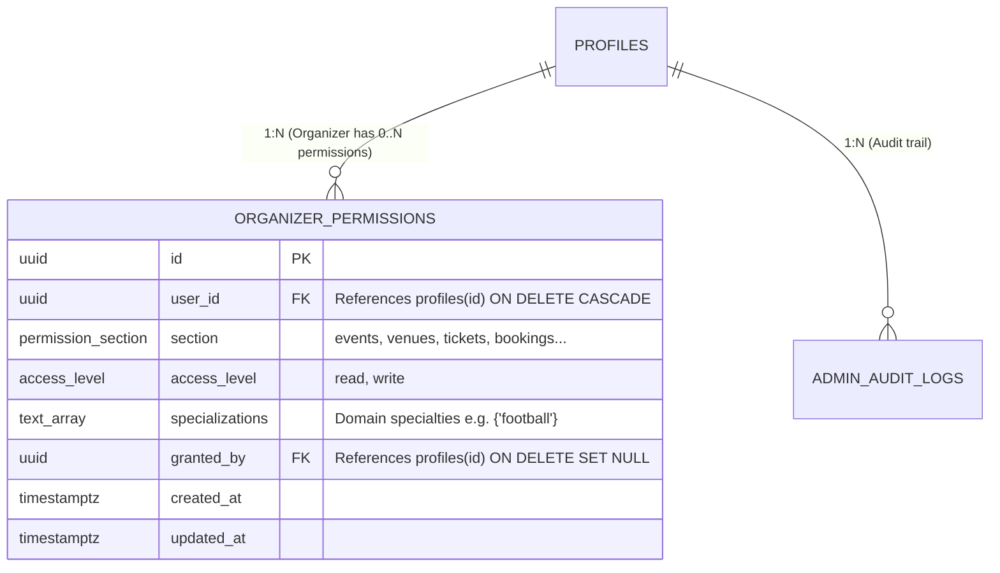
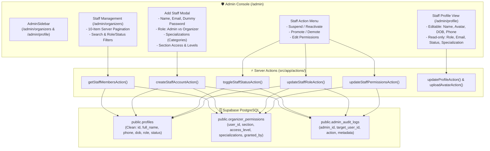
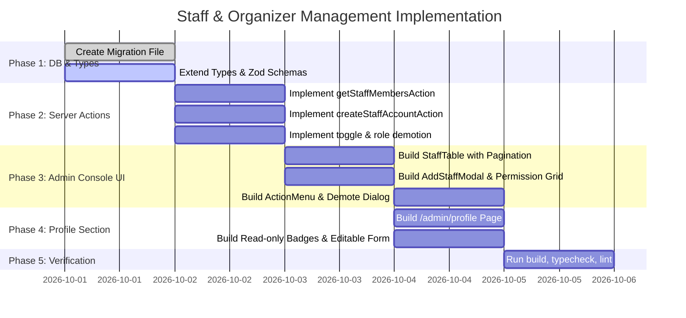

# 🛡️ Staff & Organizer Management & Profile System — Architecture & Implementation Plan

This document defines the technical specification, database schema alignment, component architecture, and implementation roadmap for the **Staff Management Console (Admins & Organizers)** and the **Dedicated Staff Profile Section** on **Tiqora**.

---

## 📑 Table of Contents

1. [Executive Summary & Objectives](#1-executive-summary--objectives)
2. [Database Schema Alignment & Migration](#2-database-schema-alignment--migration)
   - [2.1. Specialization in `organizer_permissions`](#21-specialization-in-organizer_permissions)
   - [2.2. Migration Specification](#22-migration-specification)
3. [Architecture & System Flow](#3-architecture--system-flow)
4. [Component & UX Specification](#4-component--ux-specification)
   - [4.1. Staff Management Table & Pagination (`/admin/organizers`)](#41-staff-management-table--pagination-adminorganizers)
   - [4.2. Add Staff Modal (Admin / Organizer)](#42-add-staff-modal-admin--organizer)
   - [4.3. Actions Menu & Guardrails (Suspend, Demote, Promote)](#43-actions-menu--guardrails-suspend-demote-promote)
   - [4.4. Staff Profile Section (`/admin/profile`)](#44-staff-profile-section-adminprofile)
5. [Backend Server Actions & Data Layer](#5-backend-server-actions--data-layer)
6. [Type Definitions & Validation Schemas](#6-type-definitions--validation-schemas)
7. [Shared Component & Navigation Enhancements](#7-shared-component--navigation-enhancements)
8. [Security, Governance & Audit Logging](#8-security-governance--audit-logging)
9. [Step-by-Step Implementation Roadmap](#9-step-by-step-implementation-roadmap)

---

## 1. Executive Summary & Objectives

Tiqora uses a unified account model where regular users, event organizers, and administrators all originate from `auth.users` and share the `public.profiles` table.

### Primary Objectives
1. **Unpolluted User Profiles**: Keep `public.profiles` clean. Regular fans and attendees do not store staff/organizer fields, avoiding thousands of `NULL` columns.
2. **Specializations in `organizer_permissions`**: Store domain specializations (e.g. `{"football"}`, `{"football", "music"}`) directly inside the `public.organizer_permissions` table. This ties domain expertise directly to an organizer's permissions.
3. **Granular Section Access**: Assign section-by-section access (`events`, `venues`, `tickets`, `bookings`, `coupons`, `analytics`, `support`) with specific access levels (`read` vs `write`) and maintain `granted_by` for governance.
4. **Admin Staff Console (`/admin/organizers`)**:
   - Responsive management table with server-side pagination (10 items per page), keyword search, and filters (Role and Status).
   - Onboard new Admins or Organizers with a dummy/temporary password, assign roles, specializations, and section access levels.
   - Suspend/activate staff accounts and promote/demote accounts (Admin $\leftrightarrow$ Organizer $\leftrightarrow$ User).
5. **Staff Profile Section (`/admin/profile` & adaptive `/profile`)**:
   - Allow Admins and Organizers to edit their **full name, avatar photo, date of birth, and phone number**.
   - Strictly display **email, role, specialization badges, account status, and permission matrix** as read-only verified badges.

---

## 2. Database Schema Alignment & Migration

### 2.1. Specialization in `organizer_permissions`

Rather than altering `public.profiles` (which would leave thousands of `NULL` values across standard user accounts), the domain specialization is placed directly in `public.organizer_permissions`:



### 2.2. Migration Specification

The migration file is available at:
[`supabase/migrations/20260930210000_add_specialization_to_organizer_permissions.sql`](file:///e:/Abdullah/tensorik/Events/supabase/migrations/20260930210000_add_specialization_to_organizer_permissions.sql)

```sql
-- 1. Add specializations array column to organizer_permissions table
ALTER TABLE public.organizer_permissions
ADD COLUMN IF NOT EXISTS specializations text[] DEFAULT '{}' NOT NULL;

-- 2. Create GIN index on specializations for high-speed queries
CREATE INDEX IF NOT EXISTS idx_organizer_permissions_specializations 
ON public.organizer_permissions USING GIN (specializations);

-- 3. Schema documentation comment
COMMENT ON COLUMN public.organizer_permissions.specializations IS 
'Domain event categories or specializations (e.g., {"football"}, {"music", "theatre"}) assigned to this organizer permission.';
```

---

## 3. Architecture & System Flow



---

## 4. Component & UX Specification

### 4.1. Staff Management Table & Pagination (`/admin/organizers`)
- **Route**: `src/app/admin/(dashboard)/organizers/page.tsx` (RSC)
- **Component**: `src/components/admin/organizers/staff-table.tsx` (`"use client"`)
- **Server Pagination**:
  - Accepts URL search parameters: `?page=1&q=...&role=...&status=...`
  - Fixed page size: **10 staff members per page**.
  - Re-uses `src/components/common/pagination.tsx` with dynamic item label `"staff members"`.
- **Table Columns**:
  1. **Staff Member**: Avatar, Full Legal Name, `@username`.
  2. **Contact & Email**: Email address with verification badge, Phone number.
  3. **Role**: Badge indicator (`Admin` in purple/blue, `Organizer` in emerald/teal).
  4. **Specializations**: Category tags extracted from permissions (e.g. `⚽ Football`, `🎵 Music`, or `🌐 All Categories`).
  5. **Permissions**: Summary pill (e.g. `5 sections: 3 write, 2 read`) with an interactive popover showing section breakdowns.
  6. **Status**: Interactive toggle or badge (`Active` green vs `Suspended` red).
  7. **Created At**: Formatted registration date.
  8. **Actions**: 3-dots context menu.

### 4.2. Add Staff Modal (Admin / Organizer)
- **Component**: `src/components/admin/organizers/add-staff-modal.tsx`
- **Fields**:
  - **Full Name**: Legal name of staff member.
  - **Email Address**: Used for sign-in and communication.
  - **Username**: Unique platform handle (pre-populated or custom).
  - **Temporary / Dummy Password**: Initial login password meeting security requirements (min 8 characters).
  - **Role Selector**: Radio or pill selector: `Admin` vs `Organizer`.
  - **Specialization Multi-Select**: Fetches active categories from `public.categories` and allows choosing single or multiple event specialties (e.g. Football Events, Music Festivals) or "All Categories".
  - **Section Permission Matrix** (for Organizers):
    - Table of the 7 system sections: `events`, `venues`, `tickets`, `bookings`, `coupons`, `analytics`, `support`.
    - 3-state radio buttons for each section: **None**, **Read**, **Write**.
    - Assigned specializations are recorded across the organizer's permission entries.

### 4.3. Actions Menu & Guardrails (Suspend, Demote, Promote)
- **Component**: `src/components/admin/organizers/staff-action-menu.tsx`
- **Available Actions**:
  - **Edit Permissions & Specialization**: Opens modal to adjust section access, access level, and specialization tags.
  - **Suspend / Reactivate**: Toggles account status (`active` $\leftrightarrow$ `suspended`).
  - **Promote / Demote**:
    - Admin $\rightarrow$ Organizer
    - Organizer $\rightarrow$ Admin
    - Organizer or Admin $\rightarrow$ Regular User (removes from staff, clears permissions)
- **Critical Guardrails**:
  - **Self-Lockout Protection**: An admin cannot suspend or demote their own account.
  - **Confirmation Dialog**: Role demotions require explicit confirmation via `DemoteConfirmationDialog`.

### 4.4. Staff Profile Section (`/admin/profile`)
- **Route**: `src/app/admin/(dashboard)/profile/page.tsx`
- **Component**: `src/components/admin/profile/admin-profile-view.tsx`
- **Field Behavior**:

| Field | Modifiable by Admin/Organizer? | Notes |
| :--- | :---: | :--- |
| **Full Name** | ✅ Yes | Direct update via existing profile action. |
| **Profile Photo** | ✅ Yes | Upload/Replace/Delete using WebP avatar pipeline. |
| **Date of Birth** | ✅ Yes | Verified date selection via `CustomCalendar`. |
| **Phone Number** | ✅ Yes | International phone number with format validation. |
| **Email Address** | 🔒 **Read-Only** | Displayed with verified badge; tied to authentication. |
| **Role** | 🔒 **Read-Only** | Displayed with privilege description. |
| **Specialization(s)** | 🔒 **Read-Only** | Displayed as badge tags (e.g. "Football Events Only"). Sourced from permissions. |
| **Account Status** | 🔒 **Read-Only** | Displayed as "Active" or "Suspended" badge. |
| **Assigned Permissions** | 🔒 **Read-Only** | Card listing authorized sections, access levels, and who granted them. |

---

## 5. Backend Server Actions & Data Layer

### File: `src/app/actions/admin-organizers.ts`

```typescript
// 1. Fetch staff members with pagination, filters, specializations & permissions
export async function getStaffMembersAction(params: {
  page?: number;
  pageSize?: number;
  role?: "all" | "admin" | "organizer";
  status?: "all" | "active" | "suspended";
  searchQuery?: string;
}): Promise<ServerActionResult<{
  staff: StaffMemberRow[];
  totalCount: number;
  currentPage: number;
  totalPages: number;
}>>;

// 2. Create staff account (Admin or Organizer)
export async function createStaffAccountAction(
  input: CreateStaffAccountInput
): Promise<ServerActionResult<{ userId: string }>>;

// 3. Suspend / Activate account with self-lockout check
export async function toggleStaffStatusAction(
  targetUserId: string,
  newStatus: "active" | "suspended"
): Promise<ServerActionResult<{ status: string }>>;

// 4. Update staff role (Promote / Demote) with permission cleanup
export async function updateStaffRoleAction(
  targetUserId: string,
  newRole: "admin" | "organizer" | "user"
): Promise<ServerActionResult<{ role: string }>>;

// 5. Update organizer permissions and specializations
export async function updateStaffPermissionsAction(
  input: UpdateStaffPermissionsInput
): Promise<ServerActionResult<{ updated: boolean }>>;
```

---

## 6. Type Definitions & Validation Schemas

### Type Updates in `src/types/auth.ts`
```typescript
export interface OrganizerPermission {
  id: string;
  user_id: string;
  section: PermissionSection;
  access_level: AccessLevel;
  specializations: string[]; // e.g. ['football', 'music']
  granted_by: string | null;
  created_at: string;
  updated_at: string;
}

export interface StaffMemberRow extends Profile {
  specializations: string[];
  permissions: OrganizerPermission[];
  granted_by_user?: {
    id: string;
    full_name: string | null;
    email: string | null;
  } | null;
}
```

### Zod Validations in `src/lib/validations/staff.ts`
```typescript
export const createStaffAccountSchema = z.object({
  full_name: fullNameSchema,
  email: emailSchema,
  username: usernameSchema,
  temporary_password: passwordSchema,
  role: z.enum(["admin", "organizer"]),
  specializations: z.array(z.string()).default([]),
  permissions: z.array(
    z.object({
      section: permissionSectionEnum,
      access_level: accessLevelEnum,
    })
  ).default([]),
});

export const updateStaffRoleSchema = z.object({
  target_user_id: z.string().uuid(),
  new_role: z.enum(["admin", "organizer", "user"]),
});

export const updateStaffPermissionsSchema = z.object({
  target_user_id: z.string().uuid(),
  specializations: z.array(z.string()),
  permissions: z.array(
    z.object({
      section: permissionSectionEnum,
      access_level: accessLevelEnum,
    })
  ),
});
```

---

## 7. Shared Component & Navigation Enhancements

1. **`src/components/common/pagination.tsx`**:
   - Add optional `itemLabel?: string` prop (defaulting to `"items"` or `"categories"`) so it displays `"Showing 1-10 of 14 staff members"` seamlessly.
2. **`src/components/admin/admin-sidebar.tsx`**:
   - Verify `/admin/organizers` navigation item is active.
   - Wire the footer user console card (`Admin Console`) to link to `/admin/profile`.

---

## 8. Security, Governance & Audit Logging

1. **Administrator Guard**: Every server action enforces `verifyAdminCaller()`.
2. **Self-Lockout Prevention**:
   ```typescript
   if (targetUserId === caller.id && (newStatus === "suspended" || newRole !== "admin")) {
     return { success: false, error: "Security Guardrail: You cannot suspend or demote your own admin account." };
   }
   ```
3. **Audit Trail**: Every modification inserts a row into `public.admin_audit_logs` capturing:
   - `admin_id`: ID of the performing admin.
   - `target_user_id`: Target staff account.
   - `action`: E.g. `CREATE_STAFF_ACCOUNT`, `SUSPEND_STAFF_USER`, `DEMOTE_STAFF_ROLE`, `UPDATE_STAFF_PERMISSIONS`.
   - `metadata`: Complete JSON payload of previous and new state.

---

## 9. Step-by-Step Implementation Roadmap



---

*This document is maintained as part of the Tiqora Engineering Architecture Documentation.*
